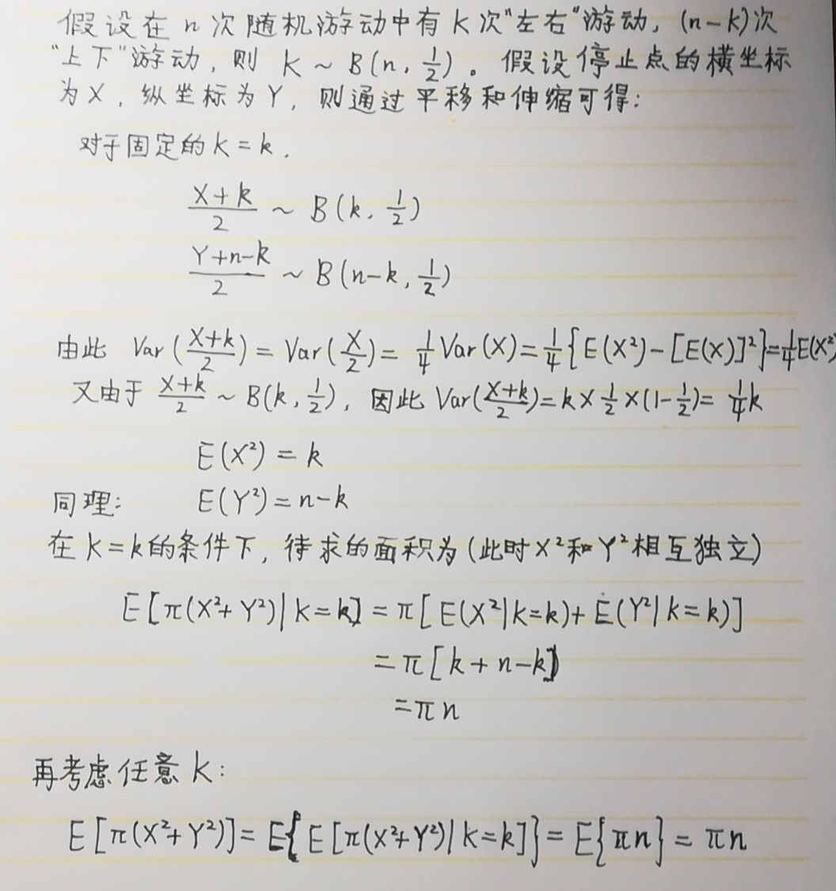

# 每日一题0628

 无8健康自摸联盟荣誉出品

[TOC]

## 【题目描述】

（2015真题）

一个粒子在二维空间中运动，每秒运动步长1，方向上、下、左、右等概率。以第n秒时粒子位置与坐标原点的连线为半径做圆，求这个圆的面积的期望。

### 解答一from hqy

> **郝氏变量法**——熟练使用类似示性函数的±1作为变量值

### 解答二from wyf

> 神奇的事情是，固定每个左右游走次数，得到的值是相同的

# 每日一题0629

 无8健康自摸联盟荣誉出品

## 【题目描述】

（2015真题）

股票市场每天都是交易日，每天的收盘点数是独立间分布的随机变量。从起始日开始，称某天为拐点，如果起始日到此日之间每日点数都上涨，紧随该日的后一天点数下降。请计算起始日到拐点之间的天数均值。

### 解答from wyf

> 求和方法太妙了。红色是wyg的修正，强调定义“间隔天数”，如此则e-2。

# 每日一题0630

 无8健康自摸联盟荣誉出品

## 【题目描述】

（2016真题）

在一个单位圆上随机取三个点，构成三角形，请计算三角形最大的内角所服从的分布。

### 解答from wyf

> 少年，你还记得线性规划么？

#### 补充示意图 from lyy：

# 每日一题0701

 无8健康自摸联盟荣誉出品

## 【题目描述】

（2015真题）

考虑一枚不均匀的硬币，已知存在随机变量N，使得连续抛掷N次，第N次的结果满足出现正面和反面的概率各为1/2。因此，即便是不均匀的硬币，也可以用于公平游戏。请给出N的具体描述，并通过计算验证其公平性。

### 解答from tlb

> 女少口阿

每组连续丢两次硬币，直到第k组出现“正反”或“反正”的组合，此时丢的两次为第2k-1次和第2k次。那么N=2k。

公平性：p(+|N) = p(-|N)。即第N次为+的组合模式（……-+）与第N次为-的组合模式（……-+）一一对应，对应的事件概率相同。

